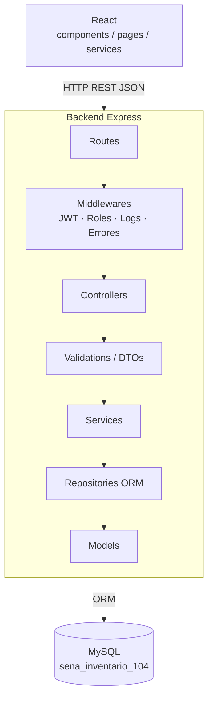
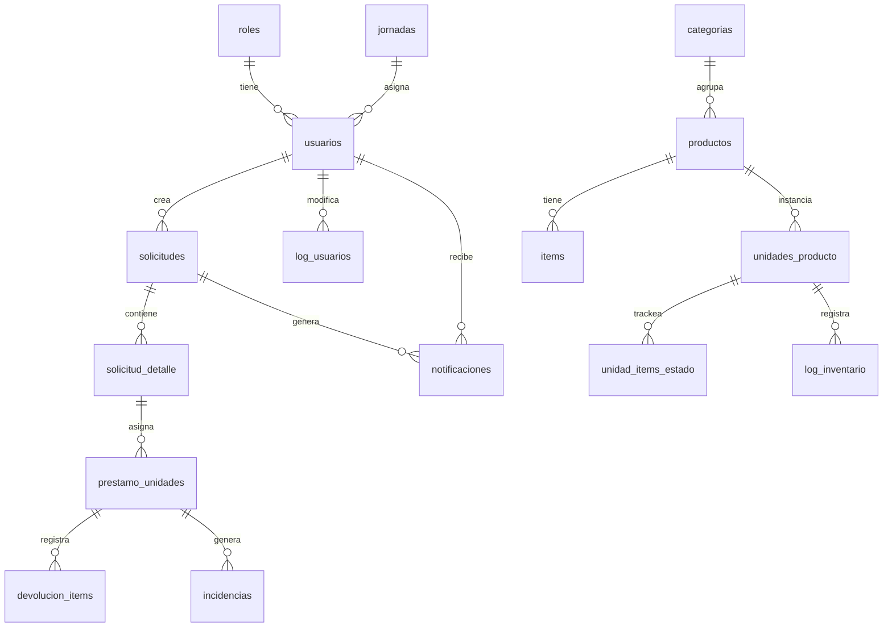
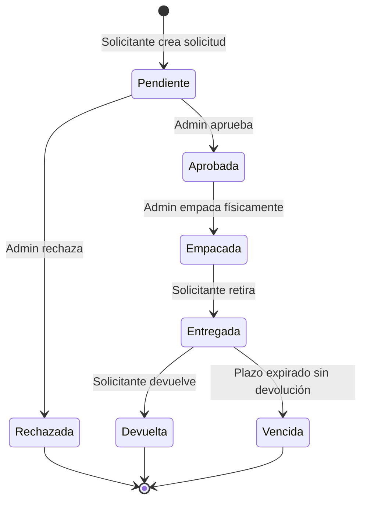

# Arquitectura del Sistema — SENA Asset Control System

## 1. Visión General

Sistema web monolítico N-capas para gestión de inventario y préstamos de equipos del Ambiente 104, SENA Quiriguá. Expone una API REST consumida por un frontend React. Dos roles: **Admin** (acceso total) y **Solicitante** (visualizar y solicitar equipos).

---

## 2. Diagrama de Capas

---

## 3. Responsabilidades por Capa

| Capa | Responsabilidad |
|---|---|
| **Routes** | Define endpoints y mapea métodos HTTP a controladores |
| **Middlewares** | Verifica JWT, valida rol, captura errores globales, registra logs |
| **Controllers** | Extrae datos del request, llama al service, devuelve respuesta HTTP |
| **Validations / DTOs** | Valida esquema de entrada; define la forma del dato que viaja entre capas |
| **Services** | Contiene toda la lógica de negocio y orquesta repositorios |
| **Repositories** | Ejecuta consultas a la BD vía ORM; único punto de acceso a datos |
| **Models** | Define entidades y esquemas de la BD |

> El frontend **no contiene lógica de negocio**. Solo consume la API y renderiza según el rol del usuario autenticado.

---

## 4. Autenticación y Autorización

- Autenticación con **JWT** almacenado en `localStorage`.
- El middleware de autorización verifica el token en cada request protegido.
- Dos roles definidos en BD:

| Rol | Permisos |
|---|---|
| **Admin** | CRUD completo de usuarios, productos, categorías e ítems. Aprobar/rechazar/empacar solicitudes. Ver reportes y logs. Registrar incidencias. |
| **Solicitante** | Ver catálogo de productos. Crear y hacer seguimiento de sus solicitudes. Recibir notificaciones. |

---

## 5. Modelo de Datos (Entidades Principales)

Arquitectura de catálogo en cadena descendente: **Categoría → Producto → Ítem → Unidad física**.

**Tablas de auditoría:** `log_usuarios`, `log_inventario` — registran cada cambio con usuario, campo, valor anterior y nuevo.

---

## 6. Flujo de una Solicitud

---

## 7. Notificaciones

Canal doble: **en sistema** (tabla `notificaciones`) + **correo electrónico**.

| Evento | Destinatario |
|---|---|
| Solicitud creada | Admin |
| Aprobación / Rechazo | Solicitante |
| Solicitud empacada | Solicitante |
| Devolución registrada | Solicitante |
| Recordatorio de vencimiento | Solicitante |

---

## 8. Decisiones Técnicas

| Decisión | Motivo |
|---|---|
| Monolito N-capas | Alcance acotado a un ambiente institucional; simplifica desarrollo y despliegue |
| MySQL relacional | El dominio (préstamos, inventario, auditoría) requiere integridad referencial fuerte |
| JWT en localStorage | Simplicidad de implementación para el alcance actual; evaluar httpOnly cookie si se expone a internet |
| ORM sobre queries directas | Reduce riesgo de SQL injection y facilita migraciones |
| Notificaciones en sistema + email | Cubre usuarios que no están activos en la app en el momento del evento |
